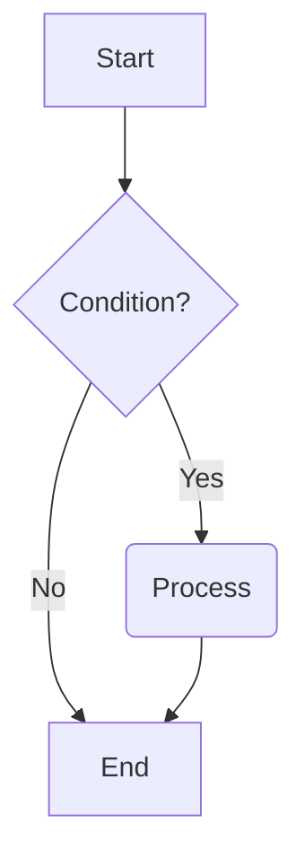
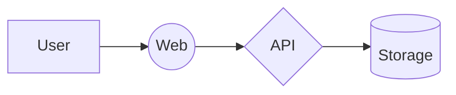

# Sample

A **simple** Markdown reader and *editor* with ~~strikethrough~~ and syntax highlighting.

## Lists

- First item
- Second item
  1. Nested ordered
  2. Continue

- [x] Completed task
- [ ] Pending task

## Code Block (Rust)

```rust
fn main() {
    let name = "mdbijou";
    println!("Hello, {name}!"); // comment
    for i in 0..3 {
        println!("{i}");
    }
}
```

## Blockquote

> This is a blockquote.
> Multi-line quote with English typesetting.

## Table

| Feature   | Status | Priority |
| --------- | ------ | -------- |
| Rendering | ✅     | P0       |
| Editor    | ✅     | P0       |

## Links

Visit [mdbijou](https://github.com/sunny0826/mdbijou).

---

End of body.

## HTML & Images

This is an HTML paragraph: <span style="color: red">red text</span> and <b>bold</b>.

<div>
  <p>Block-level HTML content (rendered as text only, not executed).</p>
</div>


## Mermaid Example




