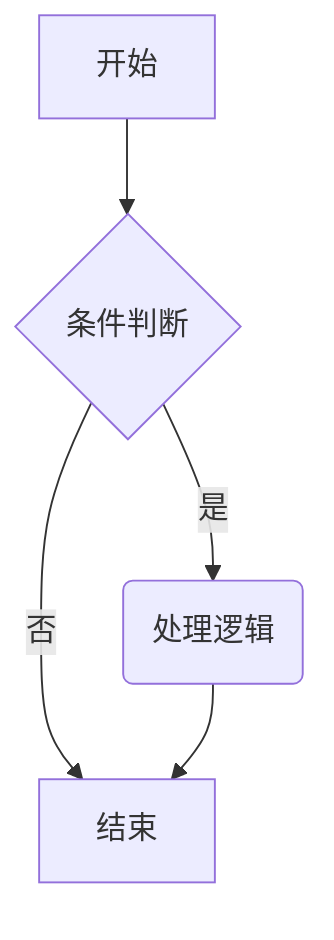
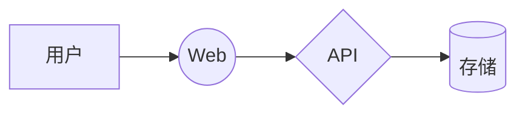

# mdbijou 示例（中文测试）

一个**简单**的 Markdown 阅读器与*编辑器*，支持 ~~删除线~~ 与语法高亮。

## 列表

- 第一项
- 第二项
  1. 嵌套有序
  2. 继续

- [x] 已完成任务
- [ ] 待办任务

## 代码块（Rust）

```rust
fn main() {
    let name = "mdbijou";
    println!("Hello, {name}!"); // 注释
    for i in 0..3 {
        println!("{i}");
    }
}
```

## 引用

> 这是引用块内容。
> 多行引用测试中文排版。

## 表格

| 功能 | 状态 | 优先级 |
| --- | --- | --- |
| 渲染 | ✅ | P0 |
| 编辑器 | ✅ | P0 |

## 链接

访问 [egui 官网](https://www.egui.rs) 和 [mdbijou](/local/path)。

---

正文结束。

## HTML 与图片

这是一个 HTML 段落：<span style="color: red">红色文字</span> 与 <b>加粗</b>。

<div>
  <p>块级 HTML 内容（仅作为文本显示，不执行）。</p>
</div>


## Mermaid 示例




